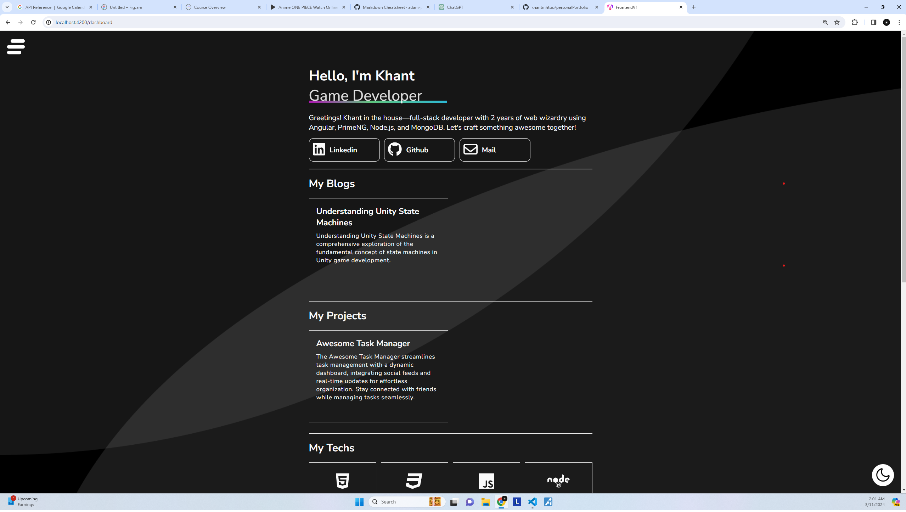
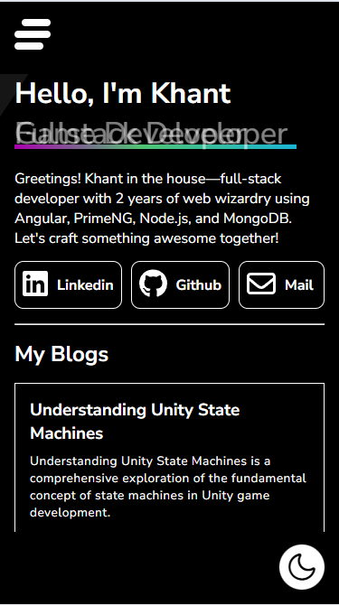

# personalPortfolio

## Description
This is a personal portfolio which highlights some of the technically skills I've developed over the years. The project is build with Angular on the Frontend and Node.js on the Backend.

Temporary Placement For Deployed Site:::

    
More

    <ul>
        In the Frontend:
        <li>Angular</li>
        <li>SCSS</li>
        <li>PrimeNG</li>
        <li>Firebase (Hosting) </li>
        In the Backend:
        <li>Node.js</li>
        <li>Express</li>
        <li>MongoDB</li>
    </ul>

---

### Preview Of The Portfolio

---

### Current Features
1. Dual Booted System
2. Project System
3. Contact System
4. Theme System
5. Blog System
6. Notification System
6. Resume System
---

### Potential Future Features Update
1. Re-design Application
2. Change up the navigation system
3. Polish up the SCSS

